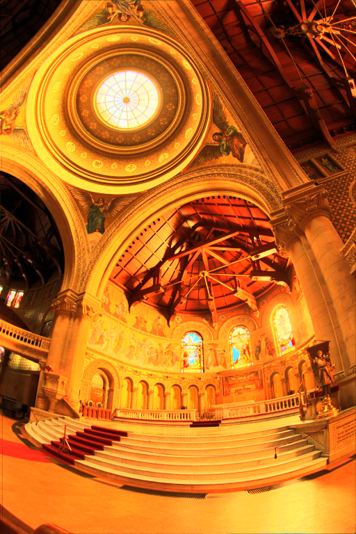

# CUDA Tone Mapping
Tone mapping an input image in CUDA as part of an university project developed for the 'Graphic Processors and Real Time Applications' course, part of the Master's Degree in 'Computer Graphics, Games and Virtual Reality' at Rey Juan Carlos University (URJC).  

The project skeleton was provided by the course professor, where I had to implement all the kernels on the `func.cu` file.

## Algorithm
**1. Find maximum and minimum luminance values on the image.**  
To determine the dynamic range of the input image, a parallel reduction kernel is implemented to find the minimum and maximum luminance values. It uses shared memory to minimize the number of times it needs to access global memory. Because thread synchronization is limited to a block, a multi-pass reduction needs to be called on a host-side loop until the final desired value is recovered.

**2. Obtain range to represent the image.**   
The luminance range of the image is calculated as the difference between the maximum and minimum luminance values.  

**3. Obtain histogram.**   
Implement an histogram kernel to obtain all the values in the same luminance range.  

**4. Obtain cumulative distribution function (CDF).**   
The CDF is the mapping function needed to scale the image's dynamic range into a displayable format. This is calculated with an exclusive scan kernel.  

<table>
  <tr>
    <td align="center">
      <b>Input image (converted to .jpg)</b> 

    </td>
    <td align="center">
      <b>Output tone mapped image</b> 
      
    </td>
  </tr>
</table>

